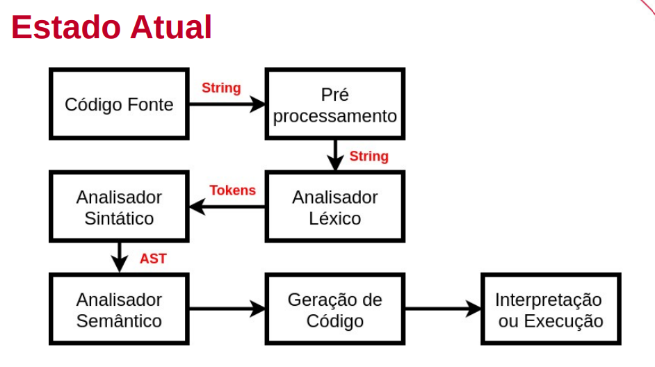

# Status dos testes


**EBNF:**
```
EXPRESSION = TERM, { ("+" | "-"), TERM } ;
TERM = FACTOR, { ("*" | "/"), FACTOR } ;
FACTOR = ("+" | "-") FACTOR | "(" EXPRESSION ")" | number ;

```

<p align="center">
  
</p>
